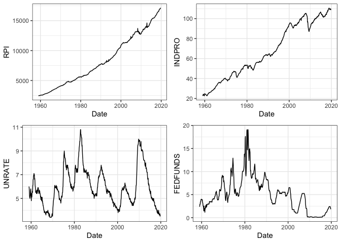
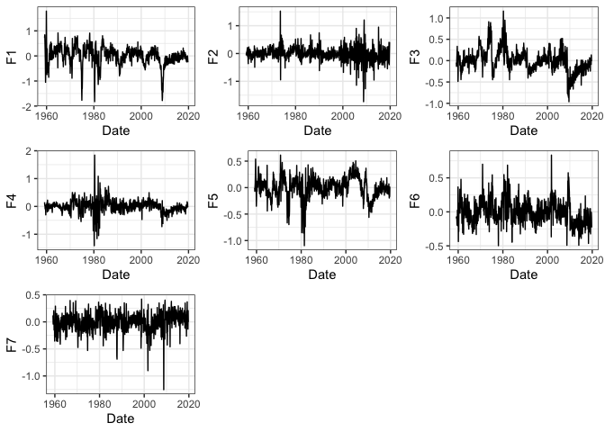
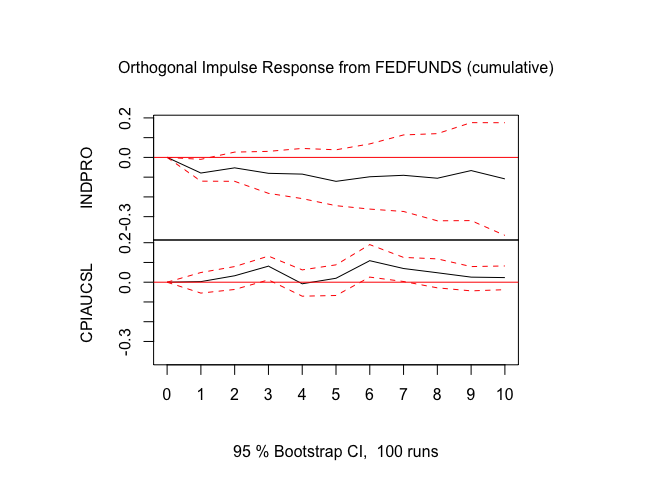

## Packages

``` r
req.packages = c("readr", "dplyr", "lubridate","missMDA", "gridExtra", "vars",
                  "ggthemes", "ggplot2","ggthemes")
invisible(lapply(req.packages, library, character.only = TRUE))
```

## Including Plots
We use the FRED-md dataset of McCracken & Ng (2015), as it is a readily available and quite diverse dataset of 128 time-series; suitable for big-data analysis [Dataset link](https://research.stlouisfed.org/econ/mccracken/fred-databases/). From the FRED-md database a MatLab companion is available, for transforming the data, however as the data here is all in levels a majority of the time-series, are non-stationary. To see this consider the plot of the series; Real personal income, industrial production index, consumer price index and the federal funds rate:

<!-- -->
Clearly non-stationary. Hence we write a simple function to transform
the entire dataset at once:

``` r 
transformX <- function(x){
y = x[,F]
  for (i in 1:n) {
  if (x[1,i] == 1) {       ## no Transformation/already stationary series
    y[4:t,i] <- x[4:t,i]
  }
  
  else  if (x[1,i] == 2) { ## First difference
    y[4:t,i] <- x[4:t,i]-x[3:(t-1),i]
  }
  
  else if (x[1,i] == 3) {  ## Second difference
    y[4:t,i] <- x[4:t,i]-2*x[3:(t-1),i]+x[2:(t-2)]
  }
  
  else if (x[1,i] == 4) {  ## Ln
    y[4:t,i] <- log(x[4:t,i])
  }
  
  else if (x[1,i] == 5) {  ## First difference of ln
    y[4:t,i] <- log(x[4:t,i])-log(x[3:(t-1),i])
  }
  
  else if (x[1,i] == 6) {  ## Second difference of ln
    y[4:t,i] <- log(x[4:t,i])-2*log(x[3:(t-1),i])+log(x[2:(t-2),i])
  }
  
  else {  ## First difference of percentage change
    y[4:t,i] <- (x[4:t,i]-x[3:(t-1),i])/x[3:(t-1),i]-(x[3:(t-1),i]-
                                                        x[2:(t-2),i])/x[2:(t-2),i]
  } 
}
  return(y)
}
```

Notice it takes only the dataframe, x, as an argument: the first column
thus has to contain the transformation codes which it conviniently does:

``` r
sX = transformX(current)
sX = sX[-(1:3),]
foo = bind_cols(DateVec[-(1:3),], sX)
p1 = ggplot(foo, aes(x = sasdate, y = RPI)) + labs(x = "Date") + geom_line() + theme_bw()
p2 = ggplot(foo, aes(x = sasdate, y = INDPRO))+ labs(x = "Date") + geom_line() + theme_bw()
p3 = ggplot(foo, aes(x = sasdate, y = UNRATE)) + labs(x = "Date") + geom_line() + theme_bw()
p4 = ggplot(foo, aes(x = sasdate, y = FEDFUNDS)) + labs(x = "Date") + geom_line() + theme_bw()
grid.arrange(p1,p2,p3,p4, nrow = 2)
```

<!-- -->
And thus the data is transformed to stationarity. As the panel is
unbalanced and with missing observations, we use an impution-procedure
(imputePCA) from a alternate package (missMDA) to impute missing
observations:

``` r
sCX = imputePCA(sX, maxiter = 150)$completeObs
colnames(sCX) = colnames(sX)
```

The principal components estimator is highly sensitive to mean and cross-sectional heteroscedasticity, hence we normalize and center the
data:

``` r
sCCX = scale(sCX, center=T, scale=T)
```

## Principal component factors

Qua the Stock & Watson (2002) dynamic factor model-estimator:

``` r
cov_yt <- t(sCCX) %*% sCCX / t
## Eigen decomposition, identical to SVD here (symmetric square matrix)
eig = eigen(cov_yt)
eig_val <- as.data.frame(eig[1]$values) ## Eigenvalue
colnames(eig_val) <- "Eigenvalue"
rownames(eig_val) <- 1:nrow(eig_val)
eig_vec <- as.data.frame(eig[2]$vectors) ## Eigenvector
colnames(eig_vec) <- 1:ncol(eig_vec)
rownames(eig_val) <- 1:nrow(eig_vec)

Factor_loadings <- sqrt(ncol(sCCX)) * eig_vec
Factor_loadings <-as.data.frame(Factor_loadings)
Factor_components <- as.matrix(sCCX) %*% as.matrix(Factor_loadings/ncol(sCCX))
Factor_components <- as.data.frame(Factor_components)

Fhat <- Factor_components[,1:7]
```

``` r
colnames(Fhat) <- c("F1", "F2", "F3", "F4", "F5", "F6", "F7")
foo = bind_cols(DateVec[-(1:3),], Fhat)

p1 = ggplot(foo, aes(x = sasdate, y = F1)) + labs(x = "Date") + geom_line() + theme_bw()
p2 = ggplot(foo, aes(x = sasdate, y = F2)) + labs(x = "Date") + geom_line() + theme_bw()
p3 = ggplot(foo, aes(x = sasdate, y = F3)) + labs(x = "Date") + geom_line() + theme_bw()
p4 = ggplot(foo, aes(x = sasdate, y = F4)) + labs(x = "Date") + geom_line() + theme_bw()
p5 = ggplot(foo, aes(x = sasdate, y = F5)) + labs(x = "Date") + geom_line() + theme_bw()
p6 = ggplot(foo, aes(x = sasdate, y = F6)) + labs(x = "Date") + geom_line() + theme_bw()
p7 = ggplot(foo, aes(x = sasdate, y = F7)) + labs(x = "Date") + geom_line() + theme_bw()
grid.arrange(p1,p2,p3,p4,p5,p6,p7, nrow = 3)
```

<!-- -->
## The FAVAR
$$\begin{bmatrix}F_t\\ Y_t \end{bmatrix} = \phi\left( L \right)\begin{bmatrix} F_{t-1}\\ Y_{t-1} \end{bmatrix} + \varepsilon_t$$

With the factors in hand we are ready to setup the VAR-model in observables and latent factors, firstly we define the
vector of time series as our observable instruments $$Y_t$$, we use industrial production, consumer price index and the federal funds rate:

``` r
colnames(sCCX) <- colnames(sX)
sCCX <- as.data.frame(sCCX)
FFRindex = which(colnames(sCCX) == "FEDFUNDS")
IPindex = which(colnames(sCCX) == "INDPRO")
CPIindex = which(colnames(sCCX) == "CPIAUCSL")
VARvector = bind_cols(Fhat, sCCX[,c(IPindex, CPIindex, FFRindex)])
```

And then we setup the FAVAR-model using the vars-package and compute the
observable impulse responses:

``` r
fitFAVAR = VAR(VARvector, type = "none", p = 13)
plot(irf(fitFAVAR, impulse = "FEDFUNDS", response = c("INDPRO", "CPIAUCSL"), cumulative = T))
```

<!-- -->

From here it is entirely possible to compute IRF from the 128 variables.
For this purpose I refer to my github/masters thesis, as it contains the theoretical walkthrough. As well as a more sophisticated computational toolbox written in MatLab [link to github-repo](https://github.com/RasmusJensen96/FAVAR).
Capable of:
 1. Conditional heteroscedasticity
 2. Alternative identification scheme (non-recursive)
 3. Alternative factor estimator (parametric state-space model)
 4. Impulse-response- and variance decomposition of the big-panel
