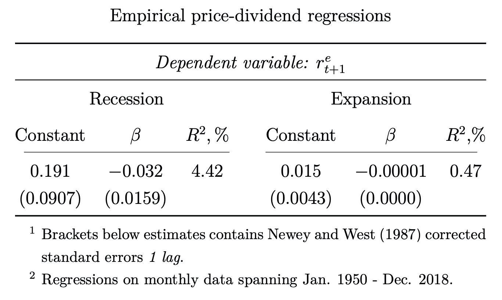

## Additional content
[MatLab replication tools](https://github.com/RasmusJensen96/Habit-Models-Advanced-Asset-Pricing): Replication guide available in the Readme of the repository.

[Full article (pdf)](../assets/files/Habit_Final.pdf)

## Hypothesis
Empirical findings suggest that predictability of financial returns differs through business cycles; high predictability under recessions, low during expansions. Can we replicate this empirical finding in a structural asset pricing model?

## Executional strategy
Setup and estimate a structural consumption-based asset pricing model. Simulate a large number of stock/bond returns under different states of the economy. Examine the properties of the simulated returns and compare them to returns of an empirical market portfolio.

## Model of choice
External habit model of Campbell & Cochrane 1999. Intuition of this model:
  - Model agents (people in the model), chooses their consumption relative to "usual" consumption, i.e. they are driven by habits.
  - Implies: The marginal utility derived from consumption today are negatively affected by the level of consumption yesterday.
In usual models: Utility affected only by absolute and not relative consumption.

A bit more mathematical intuition of the model:

$$ U(C_t, X_t) = \mathbb{E}\sum_{t=0}^{\infty}\delta^t \frac{(C_t-X_t)^{1-\gamma}-1}{1-\gamma}$$

The utility of the simulated person is given by a utility function $$U_t$$, the variables entering the utility function are consumption $$C_t$$ and a habit-level $$X_t$$. The parameters of the utility function are a subjective discount factor $$\delta$$ (how much does the agent penalize future consumption), and a parameter of relative risk-aversion $$\gamma$$.

For a technical walkthrough of the model I refer to the paper.

The model parameters are calibrated using US data spanning 1950-2018.

## Results
100,000 (8,332) months (years) worth of stock returns are simulated. Recessions are defined as "low" consumption relative to the habit-level, that is a slow growth of consumption. Three different "low" thresholds are defined as:

    1. Steady state of the model (lower than 6.7% consumption growth)
    2. Matching the empirical and model-implied recession-duration (less than 4.2% percentage growth in consumption)
    3. Extreme situation (less than 2% growth in consumption)

### Empirical regression

Emprically we see:
1. 0.191 (0.015) intercept-term in recession (expansion) accounting for the equity premium.
2. Negative (and small) but significant slope coefficient, accounting for negative relationship between price and dividend yield in recession (expansion).
3. 4.42% explainability in recessions, whilst only 0.47% in expansions

### Regression on data simulated from model

From here follows the same pattern. However we are not able to match the low equity-premium under expansions, nor the very weak linear relationship low $$\beta$$-value.

Decreasing the threshold to 2%:

We see now how the model is behaving quite in line with what we expect.

## Conclusion
After re-calibrating the model of Campbell and Cochrane (1999) and simulating from the re-calibrated model, we find that the model is able to consistently generate returns with properties similar to returns observed in the real world. Returns generated from the model, exhibits predictability only during recessions. Furthermore, the worse the recession the higher predictability from the price/dividend ratio. This result extends to the dividend yield following the reciprocal link between the two. It must be noted that the linear relationship between segments of the price-dividend ratio and excess returns remains sizable even when the surplus consumption ratio is very high, this seems not to be the case in empirical stock returns, where the co- linearity vanishes in expansions.
