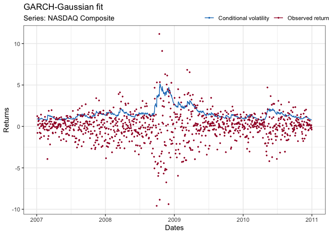
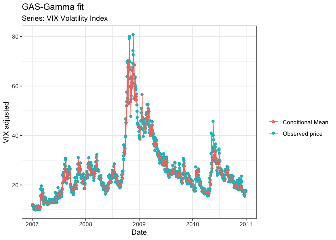
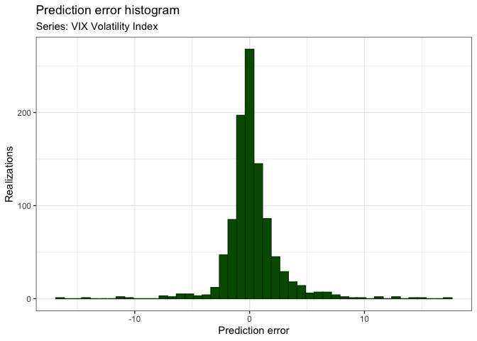

## Introduction

During my spare-time I have been/am working on a volatilty-modelling
plugin for R. The idea being that I am quite used to working in MatLab
and thus wanted to improve my skills in R. I have made a simple
Shiny-app showcasing some of the capabilities of the package:
[link to Shiny-app](https://rasmusjensen96.shinyapps.io/VolatilityModelling/?_ga=2.104123520.102457602.1592830169-1709615181.1592830169), the
website/server should be running except if I am doing work on the
application - Shiny is pretty cool.

The package at the present moment contains three models the regular
GARCH(1,1)-volatility-model and the less famous, but quite impressive
generalized autoregressive score and multiplicative error models for time-varying parameter modelling; GAS
and MEM respectively. At the moment only Gaussian and Gamma marginals
(error distributions) are supported. But the package does contain codes
meant to supply additional error probability functions (Generalized
error distribution (GED), t-dist).

## Exercise

``` r
devtools::install_github("RasmusJensen96/VolatilityModelling")
library(VolatilityModelling)
library(quantmod)
```

To consider some reasonable data, we consider the NASDAQ Composite index
and the
log-returns:

``` r
IXIC  = getSymbols("^IXIC", auto.assign = F, from = "2007-01-01", to = "2011-01-01")
lr    = as.numeric((diff(log(IXIC$IXIC.Adjusted))*100)[-1])
nDate = index(IXIC)[-1]
```

## GARCH(1,1)

``` r
fit = Estimate_GARCH(lr, nDate)
fit$Name = "NASDAQ Composite"
plot(fit)
```

<!-- -->

Consistent with our prior expectation, we see a huge volatility spike
during the financial crisis. Well, what does this imply intuitively?
Increasing volatility, corresponds to a larger risk associated with
investing. The so-called value-at-risk increases significantly when
volatility increases, hence it of great importance to the investor to
determine whether the probability of large returns, is worth the
associated risk for large losses.

## GAS(1,1)-model

The GAS-model here is based on mean modelling, with time-varying
parameters: we will attempt to model the VIX-volatility indicators
conditional
mean:

``` r
VIX = getSymbols("^VIX", auto.assign = FALSE,from = "2007-01-01", to = "2011-01-01")
VIXDat = index(VIX); VIX = as.numeric(VIX$VIX.Adjusted)
fit1 = Estimate_Gamma_GAS(VIX, VIXDat, 100)
fit1$Name = "VIX-volatility index"
ggplot() + geom_point(aes(x =  VIXDat, y = VIX, col = "Observed price")) +
  geom_line(aes(x = VIXDat, y = fit1$Filtered, col = "Conditional Mean")) + labs(x = "Date", title = "GAS-Gamma fit", subtitle = "Series: VIX Volatility Index", y = "VIX adjusted", col = " ") + theme_bw()
```

<!-- -->

Well then the Gamma-GAS model seems to proviide a quite good fit for the
conditional mean (predicted value). However how much off is the
model?

``` r
ggplot() + geom_histogram(aes(fit1$Observations-fit1$Filtered), color = rgb(0,0.25,0), fill = rgb(0,0.35,0), binwidth = 0.75) + labs(x = "Prediction error", y = "Realizations", title = "Prediction error histogram", subtitle = "Series: VIX Volatility Index") + theme_bw()
```

<!-- -->

This provides a pretty good idea about the idea of the fit, which
seemlingly captures the movements in the VIX index pretty nicely. Small
postive-skew sugggests that the Gamma-GAS-model tends to undervaluate
the VIX-index by a small margin
$$ 1/N \sum_{i=1}^N y_t - \hat{y}_t = 0.23 $$.
