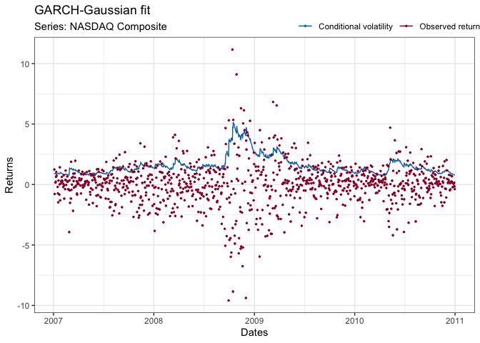
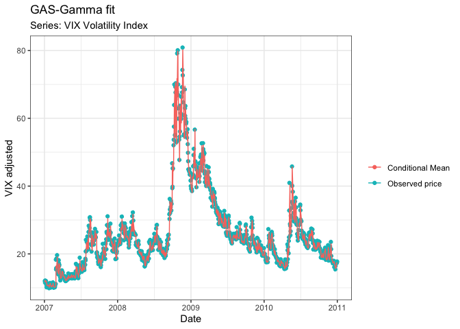

## Introduction

Being a very simple linear fitting method the ordinary least-squares (OLS) estimator is quite popular. Both in time-dimension analysis; time-series analysis and in conventional cross-sectional analysis.
The benefits of the OLS-estimator are many; under the assumption of a linear Gaussian model the estimator holds a analytical solution, which in many cases eases the computational burden associated with estimation and inference.
Secondly, under linear Gaussianity the analytical solution coincides with the maximum likelihood solution. This implies in turn that no other (paramatric) estimator are better than the OLS-estimator.
Lastly, the estimator is known and utilized throughout all of academia, implying that, except in very scarce (and specific) cases, no editor is going to question the usage of the OLS-estimator.

But really how good is the OLS-estimator given the optimum of conditions? To explore this area, and to improve my [Shiny skills](https://shiny.rstudio.com), I set out to write an app that explores the OLS-estimator in both the cross-sectional and the time-series dimension using a Monte-Carlo approach.

## The App
[The app](https://rasmusjensen96.shinyapps.io/LeastSquaresEfficiency/) relies only on native (base) R-features and ggplot. The main-panel consists of two dynamic graphs.
Firstly, a benchmark simulated data-set (the size of which is customizable by the user). If the user chooses the "Time-dimension" option, the simulated data consists of an autoregressive model of order 1 (AR(1)),
$$ y_t = \beta y_{t-1} + \epsilon_t, \qquad \epsilon_t \sim \mathcal{N}\left( 0,1\right) $$

## GARCH(1,1)

``` r
fit = Estimate_GARCH(lr, nDate)
fit$Name = "NASDAQ Composite"
plot(fit)
```

<!-- -->

Consistent with our prior expectation, we see a huge volatility spike
during the financial crisis. Well, what does this imply intuitively?
Increasing volatility, corresponds to a larger risk associated with
investing. The so-called value-at-risk increases significantly when
volatility increases, hence it of great importance to the investor to
determine whether the probability of large returns, is worth the
associated risk of large losses.

## GAS(1,1)-model

The GAS-model here is a time-varying parameter mean-model: we will attempt to model the conditional mean of the VIX-volatility indicator

``` r
VIX = getSymbols("^VIX", auto.assign = FALSE,from = "2007-01-01", to = "2011-01-01")
VIXDat = index(VIX); VIX = as.numeric(VIX$VIX.Adjusted)
fit1 = Estimate_Gamma_GAS(VIX, VIXDat, 100)
fit1$Name = "VIX-volatility index"
ggplot() + geom_point(aes(x =  VIXDat, y = VIX, col = "Observed price")) +
  geom_line(aes(x = VIXDat, y = fit1$Filtered, col = "Conditional Mean")) + labs(x = "Date", title = "GAS-Gamma fit", subtitle = "Series: VIX Volatility Index", y = "VIX adjusted", col = " ") + theme_bw()
```

<!-- -->

Well then the Gamma-GAS model seems to provide a quite good fit for the
conditional mean (predicted value). However how much off is the
model?

``` r
ggplot() + geom_histogram(aes(fit1$Observations-fit1$Filtered), color = rgb(0,0.25,0), fill = rgb(0,0.35,0), binwidth = 0.75) + labs(x = "Prediction error", y = "Realizations", title = "Prediction error histogram", subtitle = "Series: VIX Volatility Index") + theme_bw()
```

<!-- -->

This provides a pretty good idea about the idea of the fit, which
seemlingly captures the movements in the VIX index pretty nicely. Small
postive-skew sugggests that the Gamma-GAS-model tends to undervaluate
the VIX-index by a small margin
$$ 1/N \sum_{i=1}^N y_t - \hat{y}_t = 0.23 $$.
