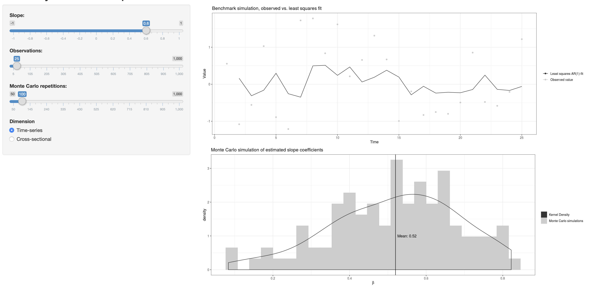

## Introduction

[Link to the app](https://rasmusjensen96.shinyapps.io/LeastSquaresEfficiency/) 

Being a very simple linear fitting method the ordinary least-squares (OLS) estimator is quite popular, both in time-dimension analysis; time-series analysis and in conventional cross-sectional analysis.
The benefits of the OLS-estimator are many; under the assumption of a linear Gaussian model the estimator holds a analytical solution, which in many cases eases the computational burden associated with estimation and inference.
Secondly, under linear Gaussianity the analytical solution coincides with the maximum likelihood solution. This implies in turn that no other (paramatric) estimator are better than the OLS-estimator.
Lastly, the estimator is known and utilized throughout all of academia, implying that, except in very scarce (and specific) cases, no editor is going to question the usage of the OLS-estimator.

But really how good is the OLS-estimator given the optimum of conditions? To explore this area, and to improve my [Shiny skills](https://shiny.rstudio.com), I set out to write an app that explores the OLS-estimator in both the cross-sectional and the time-series dimension using a Monte-Carlo approach.

## The App
[The app](https://rasmusjensen96.shinyapps.io/LeastSquaresEfficiency/) relies only on native (base) R-features and ggplot. The main-panel consists of two dynamic graphs.
Firstly, a benchmark simulated data-set (the size of which is customizable by the user). If the user chooses the "Time-dimension" option, the simulated data consists of an autoregressive model of order 1 (AR(1)):

$$ y_t = \beta y_{t-1} + \epsilon_t, \qquad \epsilon_t \sim \mathcal{N}\left( 0,1\right) $$

The correlation coefficient $$\beta$$ can be chosen by the user freely on the space spanning $$\left[-1;1\right]$$, in the time-dimension the AR(1) has a special case when $$\beta$$ is on the unit-circle (in our case -1 or 1), then the model is referred to as a random walk. In this case the OLS-estimator holds some undesirable properties.
Should the user instead opt for the "Cross-sectional"-option the model is a simple bivariate linear regression on the form:

$$ y_i = \beta x_i + \epsilon_i \qquad \epsilon_i \sim \mathcal{N}\left( 0,\sigma\right) $$

In this case I added an option to reduce or increase the noise through the slider for $$\sigma$$. Reducing the error-standard deviation to 0 results in a perfect linear relationship between $$x$$ and $$y$$ and thus an $$R^2$$-value (coefficient of determination) of 1. On the other hand increasing the magnitude of the noise, decreases the $$R^2$$-value indefinitely (equivalent to decreasing the signal-to-noise ratio).

The second panel shows a histogram and a kernel-density plot (probability-distribution approximation) of a Monte-Carlo simulation of a user-specified number of random simulations. For very small Monte-Carlo samples the density is poorly behaving, increasing the number of MC-replications it is evident the the Central Limit Theorem and Law of Large numbers works its magic. The mean of the approximate PDF is close to the true mean with the characteristic normal-bell shape around the mean (as it should). Increasing the sample size (N) further increases the precision of the slope estimates. 

## Results/graphs
I will cover the two different dimensions in steps, so firstly let us start with the simple bivariate cross-sectional simulation:
### Cross-section
In the simulation we conduct the main-focus is the impact of the signal-to-noise ratio, so we consider the simulation:

$$ y_i = 0.6 x_i + \epsilon_i \qquad \epsilon_i \sim \mathcal{N}\left( 0,\sigma\right) $$

for $$\sigma \in \left\{0.1, 1, 5\right\}$$. The three plots are reported below and discussed afterwards.

<!-- -->
<!-- -->
<!-- -->

So immediately it is clear that the OLS-estimator, works very well in all cases, notice that there is no simulation bias, such that over all 1.000 simulations the mean of the slope coefficient is (almost) equal to the population value 0.6, the one I supplied prior to simulation. The difference over the different simulations lies in the ability to predict the value of $$y_i$$ given the value of $$x_i$$ and of course as the deterministic component $$\beta x_i$$ becomes smaller relative to the stochastic $$\epsilon$$ the degree of explainability decreases. For this reason, the smaller the standard deviation (expected deviation from the mean) of the stochastic compenent the larger the fraction of $$y_i$$ is our simple model able to explain. With an expected deviation from the mean of .01 we are able to explain 97% of $$y_i$$, while a standard deviation of 5 gives us merely 2%-explainability.

### Time-series
Here we have different aspects to cover so we do so gradually. Firstly, we cover the basics namely the efficiency, consistency and unbiasedness of the OLS-estimator in the time-dimension:

<!-- -->
<!-- -->

The two first figures illustrates that increasing the number of observations leads to better estimates of the parameter, this relates to the consistency of the estimator. We have not proven consistency, as that is a mathematically well-established algebraic result, however it seems to hold empirically atleast. With our rather conservative sample-sizes. Furthermore, we see that increasing the data-points also decreases the standard deviation of the estimator quite significantly in our MC-study (second-panel (the space covered by the first axis is very small when the number of data-points increases indefinitely (relating to the efficiency of the estimator))).

<!-- -->

The figure stands to show why random-walks $$\beta = 1$$ is a bad situation. Notice in the MC-study that it seems as though the estimated density is almost "collapsed" upon itself. This is referred to as a situation of super-consistency (the estimator converges very (too) quickly to the population parameter) and it invalidates regular hypothesis tests. Another thing to note is the very unpredictable nature of the random walk (the error term never vanishes in the memory of the process, thus the random walk almost surely diverges indefinitely in the limit).

<!-- -->
<!-- -->

Lastly, these two plots stands to show, that a negative unit-root is as bad as a positive one (collapses upon itself in the MC-study) as inference is very limited. The second graph shows how the OLS-estimator is capable of estimating negative roots holding the same nice properties as it did in the positive case. 

## Thank you
[Link to the app](https://rasmusjensen96.shinyapps.io/LeastSquaresEfficiency/) 

