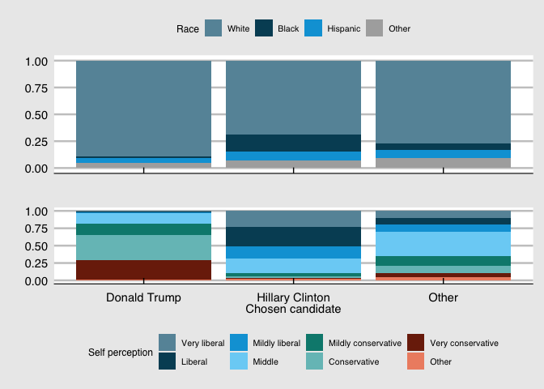
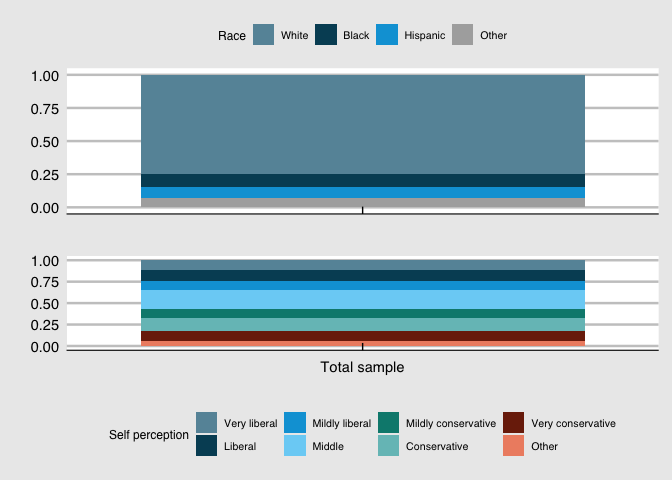
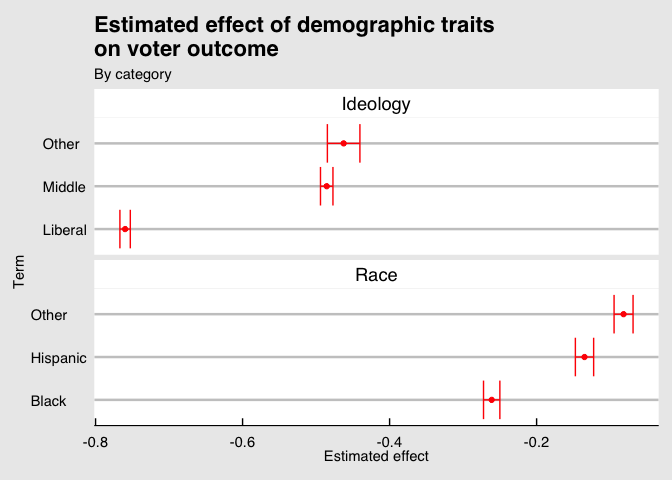
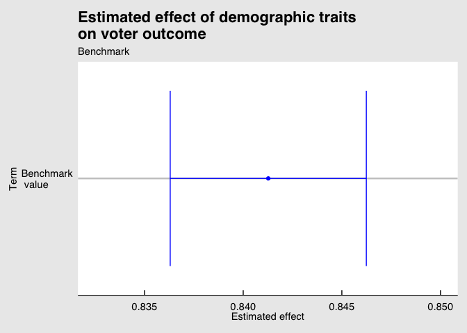

So usually I work with time-series data. To not rust up completely on
cross-sectional data-analysis, I chose to conduct this “study” on voter
behavior. I chose to work with voter surveys of the US, as these are
readily available with quite convinient terms of use (contrary to Danish
voter surveys, which unfortunately are quite stringent in their terms of
use and availability).

Please note that this is mainly conducted “just for fun”, hence the
choice of topics to examine are mainly out of curiosity and are, by no
means, to be considered as taking a stance on politics what-so-ever.

All data used are available on the curtouisy of the [Harvard Dataverse
Databank](https://dataverse.harvard.edu/file.xhtml?persistentId=doi:10.7910/DVN/ZSBZ7K/C1YVSF&version=6.0%20https://dataverse.harvard.edu/api/access/datafile/3588803?format=RData&gbrecs=true).

We start of by loading dependencies, as the dataset is of a medium size,
60.000 observations in 526 variables, we dont require methods for
handling very large datasets such as the “datatables” package.

``` r
load("/Users/rasmus/Downloads/cces18_common_vv.RData")
library(ggplot2)
library(tidyverse)
library(broom)
library(gridExtra)
library(ggthemes)
```

The dataset contains a variety of different socioeconomical variables,
categorical and our central variable which is concerned with the actual
vote casted by the individual during last election (2016).

So firstly we can take a look at the the socioeconomic classification of
the subpopulation for the candidates.

### Data visualization

``` r
f1 = x %>% 
  select(race, CC18_317) %>%
  mutate(race = fct_lump(as.factor(race), 3)) %>% 
  mutate(CC18_317 = fct_lump(as.factor(CC18_317), 2)) %>%
  na.omit() %>%  
  mutate(CC18_317 = as.factor(CC18_317)) %>%
  mutate(race = as.factor(race)) %>% 
  ggplot() + geom_bar(aes(x = CC18_317, fill = as.factor(race)), position = "fill") +
  scale_x_discrete(labels = c("Donald Trump", "Hillary Clinton", "Other")) +
  scale_fill_economist(labels = c("White", "Black", "Hispanic", "Other")) + 
  theme_economist_white() +
  labs(x = " ",
       y = " ",
       fill = "Race") + theme(
         legend.title = element_text(size = 9),
         legend.text = element_text(size = 8),
         axis.text.x = element_blank()
       )
f2 = x %>% select(CC18_317, CC18_334A) %>%  
  mutate(CC18_317 = fct_lump(as.factor(CC18_317), 2)) %>%
  mutate(CC18_334A = as.factor(CC18_334A)) %>%
  na.omit() %>%
  ggplot() + geom_bar(aes(x = CC18_317, fill = CC18_334A), position = "fill") + 
  scale_x_discrete(labels = c("Donald Trump", "Hillary Clinton", "Other")) +
  scale_fill_economist(
    labels = c(
      "Very liberal",
      "Liberal",
      "Mildly liberal",
      "Middle",
      "Mildly conservative",
      "Conservative",
      "Very conservative",
      "Other"
    )
  ) + theme_economist_white() +
  labs(x = "Chosen candidate",
       y = " ",
       fill = "Self perception") + theme(
         legend.title = element_text(size = 9),
         legend.text = element_text(size = 8),
         legend.position = "bottom"
       )
grid.arrange(f1, f2, ncol = 1)
```

<!-- --> 

It should be noted
here that the barplots shows the relative percentage of the
subpopulation voting for each candidate holding a respective trait. It does thus not
tell us anything about the size of each subpopulation (How many voted
for each candidate) nor how the relative composition of the total sample
looks. It is however relatively easy to determine:

``` r
f1 = x %>% select(race) %>% 
  mutate(race = fct_lump(as.factor(race), 3)) %>% 
  na.omit() %>%
  mutate(race = as.factor(race)) %>% ggplot() + 
  geom_bar(aes(x = as.factor(rep(1, length(race
  ))), fill = as.factor(race)), position = "fill") +
  scale_fill_economist(labels = c("White", "Black", "Hispanic", "Other")) + 
  theme_economist_white() +
  labs(x = " ",
       y = " ",
       fill = "Race") + theme(
         legend.title = element_text(size = 9),
         legend.text = element_text(size = 8),
         axis.text.x = element_blank()
       )
f2 = x %>% select(CC18_334A) %>% 
  mutate(CC18_334A = as.factor(CC18_334A)) %>% 
  na.omit() %>% 
  ggplot() + geom_bar(aes(x = as.factor(rep(
  1, length(CC18_334A)
)), fill = CC18_334A), position = "fill") +
  scale_x_discrete(labels = c("Total sample")) +
  scale_fill_economist(
    labels = c(
      "Very liberal",
      "Liberal",
      "Mildly liberal",
      "Middle",
      "Mildly conservative",
      "Conservative",
      "Very conservative",
      "Other"
    )
  ) + theme_economist_white() +
  labs(x = " ",
       y = " ",
       fill = "Self perception") + theme(
         legend.title = element_text(size = 9),
         legend.text = element_text(size = 8),
         legend.position = "bottom"
       )
grid.arrange(f1, f2, ncol = 1)
```

<!-- -->

What this tells us is that there is a mismatch between the demographic
composition of the voters and the voters of the chosen candidate (Donald
Trump), and that the sample composition is more similar to the
Clinton-voting subpopulation. This corresponds to a tendency to vote for
Donald Trump for the white subpopulation, while the black and hispanic
subpopulation seems too favor Hillary Clinton. The second panel in each
figure tells us what we already have hypothesized - namely that voters
perceiving themselves as being liberal (conservative) seems to favor
Hillary Clinton (Donald Trump).

### Model

This kind of analysis is very visual and tends to not give us
quantifiable results. To obtain a better interpretation of the effects
associated with different demographic/socioeconomic traits, we set out
to conduct a “all-else-equal”-study, a way to do so is by
cross-sectional regression. To set up a regression we have to
hypothesize as to which variables affect the vote-outcome. We choose
three variables, the two in the plot above (Selfperception of ideology
and race), moreover as we speculate that income may be infuencing the
voting behavior we include an income bracket distinction. That is the
regression is a so-called linear probability model (linear regression
with binary outcome), as explained by categorical independent variables
(income, race selfpercieved ideology).

    ## 
    ## Call:
    ## lm(formula = vote == 1 ~ race + ideo + faminc_new, data = .)
    ## 
    ## Residuals:
    ##      Min       1Q   Median       3Q      Max 
    ## -0.85656 -0.08520 -0.00375  0.16040  1.20757 
    ## 
    ## Coefficients:
    ##                            Estimate Std. Error  t value Pr(>|t|)    
    ## (Intercept)                0.833856   0.025303   32.955   <2e-16 ***
    ## raceBlack                 -0.259537   0.005704  -45.504   <2e-16 ***
    ## raceHispanic              -0.133872   0.006347  -21.093   <2e-16 ***
    ## raceOther                 -0.081455   0.006589  -12.362   <2e-16 ***
    ## ideoLiberal               -0.758965   0.003609 -210.285   <2e-16 ***
    ## ideoMiddle                -0.485023   0.004327 -112.090   <2e-16 ***
    ## ideoOther                 -0.461163   0.011332  -40.697   <2e-16 ***
    ## faminc_newVery low income -0.022922   0.026825   -0.854    0.393    
    ## faminc_newLow income       0.005742   0.025420    0.226    0.821    
    ## faminc_newMiddle income    0.010314   0.025319    0.407    0.684    
    ## faminc_newHigh income     -0.009680   0.025593   -0.378    0.705    
    ## faminc_newPnts             0.022704   0.025716    0.883    0.377    
    ## ---
    ## Signif. codes:  0 '***' 0.001 '**' 0.01 '*' 0.05 '.' 0.1 ' ' 1
    ## 
    ## Residual standard error: 0.3392 on 46303 degrees of freedom
    ## Multiple R-squared:  0.5263, Adjusted R-squared:  0.5262 
    ## F-statistic:  4677 on 11 and 46303 DF,  p-value: < 2.2e-16

So by releveling the data the slope coefficients are changes to the
benchmark person (White, Household-income \>499.999 USD, Selfpercieved
conservative). The benchmark person has according to the model has a 88%
probability to vote for Donald Trump, whilst a similar person (wealthy,
conservative) of black heritage has a 88%-36%=52% probability of voting
for Donald Trump according to the model. A white, very wealthy,
selfperecieved liberal hold a 88%-76%=12% chance of voting for Donald
Trump. Unfortunately, the income-variables are statistically insignificant at a 5%-significance level. For this reason
we construct a new model without the income variables.

``` r
fit = dat %>% lm(vote == 1 ~ race + ideo, .)
summary(fit)
```

    ## 
    ## Call:
    ## lm(formula = vote == 1 ~ race + ideo, data = .)
    ## 
    ## Residuals:
    ##      Min       1Q   Median       3Q      Max 
    ## -0.84127 -0.08147  0.00023  0.15873  1.17964 
    ## 
    ## Coefficients:
    ##               Estimate Std. Error t value Pr(>|t|)    
    ## (Intercept)   0.841270   0.002536  331.77   <2e-16 ***
    ## raceBlack    -0.261101   0.005673  -46.02   <2e-16 ***
    ## raceHispanic -0.134839   0.006341  -21.27   <2e-16 ***
    ## raceOther    -0.081700   0.006588  -12.40   <2e-16 ***
    ## ideoLiberal  -0.759805   0.003607 -210.67   <2e-16 ***
    ## ideoMiddle   -0.485532   0.004326 -112.24   <2e-16 ***
    ## ideoOther    -0.462508   0.011293  -40.96   <2e-16 ***
    ## ---
    ## Signif. codes:  0 '***' 0.001 '**' 0.01 '*' 0.05 '.' 0.1 ' ' 1
    ## 
    ## Residual standard error: 0.3394 on 46308 degrees of freedom
    ## Multiple R-squared:  0.5259, Adjusted R-squared:  0.5259 
    ## F-statistic:  8562 on 6 and 46308 DF,  p-value: < 2.2e-16

We find with this specification that all explanatory variables are
independently (t-tests) and jointly (F-test) statistically significant.
To get a more graphical idea about the model, let us try to obtain a
visualization the coefficients.

``` r
fit =  fit %>% tidy(.,conf.int = T) %>% 
  mutate(type = ifelse(str_detect(term, "^race"), "Race", 
                       ifelse(str_detect(term, "ideo"), "Ideology", "Benchmark"))) %>% 
  mutate(term = ifelse(str_detect(term, "^race"),
                       sub("^race","", term), sub("^ideo","", term))) %>% 
  arrange(desc(estimate)) 

fit %>% filter(term != "(Intercept)") %>% 
  ggplot(aes(estimate, term)) +
  geom_point(colour = rgb(1,0,0)) + 
  geom_errorbarh(aes(xmin = conf.low, xmax = conf.high), color = rgb(1,0,0)) +
  facet_wrap(~ type, ncol = 1, scales = "free_y") + 
  labs(title = "Estimated effect of demographic traits\non voter outcome ",
       subtitle = "By category",
       x = "Estimated effect",
       y = "Term") + theme_economist_white() + scale_colour_economist()
```

<!-- -->

``` r
fit %>% filter(term == "(Intercept)") %>%
  ggplot(aes(estimate, "Benchmark\n value")) +
  geom_point(colour = rgb(0, 0, 1)) +
  geom_errorbarh(aes(xmin = conf.low, xmax = conf.high), color = rgb(0, 0, 1)) +
  labs(
    title = "Estimated effect of demographic traits\non voter outcome ",
    subtitle = "Benchmark",
    x = "Estimated effect",
    y = "Term"
  ) +  xlim(c(0.8325, 0.85)) + theme_economist_white() + scale_colour_economist() 
```

<!-- -->

We say statistically speaking that with 95% certainty the mean probability for
a white republican to vote for Donald Trump in 2016 was between 83.6%
and 84.6%. For an equivalent person with a liberal self percievience
that probability is around 76 percentage points lower, while people
perceiving themselves as “middle-of-road” ideologically holds around an
“all-else-equal” 48 percentage points lower probability of voting
Trump 2016 compared to a selfpercieved republican according to the
model. People differing in race from white, all have a lower probability
to vote for Donald Trump with the strongest effect being black persons
holding a mean decrease in fitted probability of around 25 percentage
points, hispanics holding a decrease of around 18 percentage points.

### Conclusive remark

This primitive study did not actually reveal us anything too surprising,
but it fulfilled its purpose of letting me do a bit of cross-sectional
and categorical modelling and data-handling.
